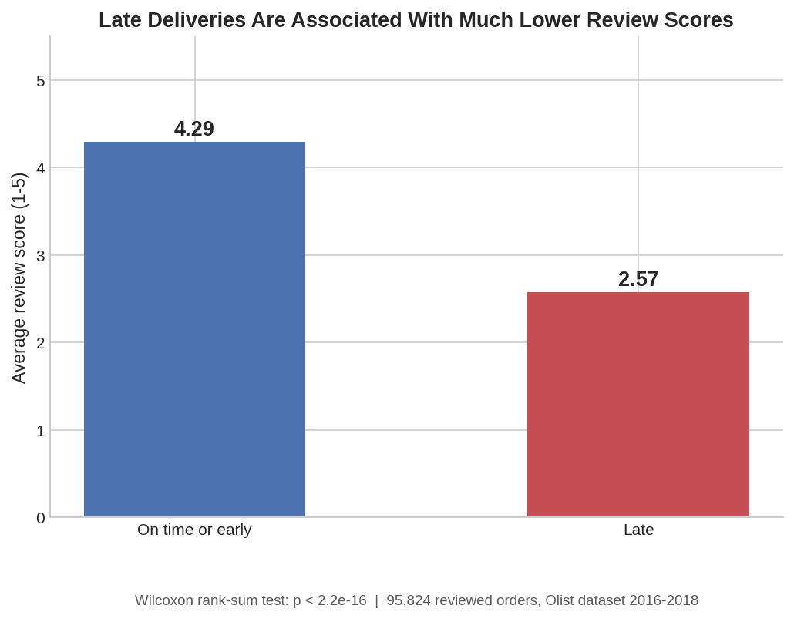

# E-Commerce Delivery Delay, Customer Satisfaction & Retention Analysis

## Overview

An analysis in R of the Olist Brazilian e-commerce dataset, examining how much late deliveries actually hurt customer satisfaction and retention, and where operational improvements would matter most. Originally submitted as a project for Data Analysis and Software (Prof. Emmanuel Peterle), it tests the relationship formally with Wilcoxon rank-sum and Chi-square tests rather than relying on the visual pattern alone, then extends into cohort-based revenue retention and category-level analysis.

## Business Question

How much do late deliveries hurt customer satisfaction and retention, and where should improvements be prioritised?

## Data Source

[Brazilian E-Commerce Public Dataset by Olist](https://www.kaggle.com/datasets/olistbr/brazilian-ecommerce), a public dataset of 99,441 orders placed on the Olist marketplace between late 2016 and mid-2018, with the majority of transactions in 2017. Six tables were used: orders, order items, customers, reviews, products, and the product category translation table. Geolocation and payment detail tables were excluded, since they weren't central to this research question.

## Methodology

* **Unit of analysis**: the delivered order for delivery and satisfaction analysis, the customer for retention analysis, and the product category for category-level analysis.
* **Delivery delay**: calculated as the actual delivery date minus the estimated delivery date, in days. Positive values are Late, zero or negative are On time or early.
* **Data cleaning**: of 96,478 delivered orders, 96,470 (99.99%) had valid delivery and estimated delivery dates and were retained. Of those, 95,824 (99.3%) had an associated review score; review-based statistics and tests use that subset.
* **Statistical tests**: a Wilcoxon rank-sum test compares review score distributions between Late and On time or early orders, appropriate since review scores are ordinal and not guaranteed to be normally distributed. A Chi-square test on a Low (1-3) vs High (4-5) recoding checks the pattern holds under a simple satisfied/unsatisfied split. A second Chi-square test checks whether repeat purchase rate is associated with a customer's first delivery experience.
* **Cohort revenue retention**: customers are grouped by the month of their first purchase (cohort month), and revenue in each subsequent month is measured relative to the cohort's month-0 revenue, normalised to 100%.
* **Category-level analysis**: order items are mapped to English category names and aggregated by revenue, late rate, and average review score.

## Key Findings

**Delivery performance.** 6.8% of delivered orders arrived late (7,826 of 96,470). Most deliveries in this dataset arrive early rather than merely on time, visible as a strong left skew in the delay distribution, but the right tail of late orders is large enough to matter at scale.

**Customer satisfaction.** Late deliveries are associated with a large, statistically significant drop in review scores: **4.29 average for on-time/early deliveries versus 2.57 for late ones**, a difference of nearly two points on a five-point scale (Wilcoxon rank-sum test, p < 2.2e-16). The median score drops from 5 to 2. Recoded as satisfied vs unsatisfied, the pattern holds: a strong association between late delivery and receiving a low review (Chi-square = 9,859.5, p < 2.2e-16).

**Late deliveries are also less predictable, not just worse on average.** Review score variability is about 45% higher for late deliveries (SD 1.66) than for on-time ones (SD 1.15). On-time deliveries produce consistently high scores; late deliveries produce a wider, more polarised spread, some customers are far more forgiving than others of the same delay.

**Retention.** Customers whose first delivered order was late repeat-purchase at **2.51%**, versus **3.04%** for customers whose first delivery was on time or early, a **relative drop of about 17%** (Chi-square test, p = 0.010). The absolute gap is small because repeat purchase rates are low across the board on this dataset, but the relative difference is meaningful given the platform's order volume and the cumulative value of repeat customers.

**Revenue retention decays fast after the first purchase.** Cohort-based revenue retention (month 0 normalised to 100%) falls to **5.42% by month 1**, and to roughly **0.2-0.3%** from month 3 onward, staying low and flat through month 12. Most customer spend happens in the acquisition month itself, which means retention efforts aimed at months 6-12 are targeting a much smaller opportunity than efforts aimed at month 1.

**Revenue concentrates in a handful of categories.** Health & Beauty, Watches & Gifts, and Bed, Bath & Table are the top revenue categories, each with late rates in the typical 6-7% range and generally high average review scores. Late delivery isn't concentrated in a few problem categories, it's a fairly uniform operational issue, which means fixing it in the highest-revenue categories first gives the best return on a fixed improvement effort.

## Business Recommendations

1. **Prioritise on-time delivery for first-time customers.** A late first delivery measurably reduces the odds of a second purchase. Faster fulfilment, priority warehouse picking, or more reliable carriers for first orders would target the highest-leverage moment in the customer relationship.
2. **Focus logistics improvements on high-revenue categories.** Late rates are similar across categories, so reliability gains in Health & Beauty and Bed, Bath & Table would generate the best return given their revenue share.
3. **Use delivery delay as an early-warning signal, not just an operational metric.** Since late-delivery reactions are more variable, real-time delay monitoring with proactive customer notification or compensation could reduce the dissatisfaction that shows up in reviews before it happens.
4. **Track late delivery rate as a customer experience KPI**, not only a logistics KPI, since it demonstrably connects to both review scores and repeat purchase behaviour.

## Limitations

This is observational data, not a controlled experiment, so it shows association, not proven causation. Results reflect 2016-2018 marketplace behaviour and may not generalise to later periods. No data on delivery partner identity was available, which would have let this analysis isolate carrier-level effects from platform-level ones.

## Tools & Skills

**Tools**: R (tidyverse, lubridate), ggplot2

**Skills demonstrated**: data cleaning and joining across multiple relational tables, hypothesis testing (Wilcoxon rank-sum, Chi-square), cohort-based retention analysis, category-level aggregation, statistical interpretation, and business recommendation writing from quantitative findings.

## Files in this Repository

* `olist_delivery_retention_analysis.R`, the full analysis script.
* `Delivery_Performance_Customer_Satisfaction_and_Retention_in_Ecommerce.pdf`, the full written report this README is based on, including all tables, figures, and business recommendations in detail.
* `olist_orders_dataset.csv`, `olist_order_items_dataset.csv`, `olist_order_reviews_dataset.csv`, `olist_customers_dataset.csv`, `olist_products_dataset.csv`, `product_category_name_translation.csv`, the six source tables used in the analysis.
* `chart_review_score.png`, `chart_repeat_purchase.png`, `chart_revenue_retention.png`, key result charts.
